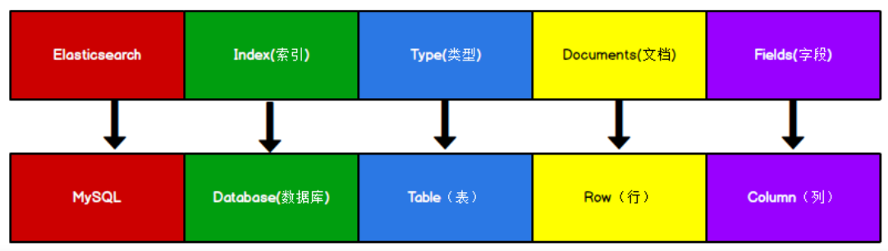

> 本文参考：[https://blog.csdn.net/u011863024/article/details/115721328](https://blog.csdn.net/u011863024/article/details/115721328)

# ES 部署

## Linux 单节点部署

### 下载

官网下载地址：[https://www.elastic.co/cn/downloads/elasticsearch](https://www.elastic.co/cn/downloads/elasticsearch)

选择合适的版本下载，可以在 windows 下载后 上传到 linux。

> 注意由于 es 和 jdk 是一个强依赖的关系，所以当我们在新版本的 es 压缩包中包含有自带的 jdk，但是当我们的 linux 中已经安装了 jdk 之后，就会发现启动 es 的时候优先去找的是 linux 中已经装好的 jdk，此时如果 jdk 的版本不一致，就会造成 jdk 不能正常运行 。具体 es 和 jdk 的对应版本参考：[https://www.elastic.co/cn/support/matrix#matrix_browsers](https://www.elastic.co/cn/support/matrix#matrix_browsers)

也可以在Linux命令行，直接执行以下命令进行下载（下载比较慢）：

```sh
wget https://artifacts.elastic.co/downloads/elasticsearch/elasticsearch-7.3.2-linux-x86_64.tar.gz
```


### 解压

```sh
# ES的下载位置
cd /home/changyansong/Elasticsearch/
tar -zxvf elasticsearch-7.3.2-linux-x86_64.tar.gz
```


### 创建用户

因为安全问题， ES 不允许 root 用户直接运行，所以要创建新用户。

由于我用的是自己的用户，所以这一步可以跳过。


### 修改配置文件

修改配置文件：`/home/changyansong/Elasticsearch/elasticsearch-7.3.2/config/elasticsearch.yml`

```sh
# 加入以下配置
cluster.name: elasticsearch
node.name: node-1
network.host: 0.0.0.0
http.port: 9200
cluster.initial_master_nodes: ["node-1"]
```


### 启动

```sh
cd /home/changyansong/Elasticsearch/elasticsearch-7.3.2/bin/
# 前台启动
./elasticsearch
# 后台启动
./elasticsearch -d
```

启动后可以使用 `jps` 命令看到后台 ES 进程。


### 测试

测试是否成功启动，输入命令：`curl http://localhost:9200`。

服务器返回：

```sh
{
  "name" : "icx31",
  "cluster_name" : "elasticsearch",
  "cluster_uuid" : "y0X2KKjdQnWPG1kWgJH9qQ",
  "version" : {
    "number" : "7.3.2",
    "build_flavor" : "default",
    "build_type" : "tar",
    "build_hash" : "1c1faf1",
    "build_date" : "2019-09-06T14:40:30.409026Z",
    "build_snapshot" : false,
    "lucene_version" : "8.1.0",
    "minimum_wire_compatibility_version" : "6.8.0",
    "minimum_index_compatibility_version" : "6.0.0-beta1"
  },
  "tagline" : "You Know, for Search"
}
```


# ES 入门

## 倒排索引

ES 是**面向文档型数据库**，一条数据在这里就是一个文档。 为了方便大家理解，我们将 ES 里存储文档数据和关系型数据库 MySQL 存储数据的概念进行一个类比:



ES 里的 Index 可以看做一个库， Documents 则相当于表的行。


## HTTP-创建索引

对比关系型数据库，创建索引就等同于创建数据库。 

向 ES 服务器发送 PUT 请求：

```sh
# 后面接 jq 是将返回的 JSON 字符串格式化
curl -X PUT http://127.0.0.1:9200/shopping | jq
```

服务器返回响应：

```sh
{
    "acknowledged": true,//响应结果
    "shards_acknowledged": true,//分片结果
    "index": "shopping"//索引名称
}
```


## HTTP-查询和删除索引

### 查看所有索引

向 ES 服务器发送 GET 请求：

```sh
curl -X GET http://127.0.0.1:9200/_cat/indices?v
```

这里请求路径中的 _cat 表示查看的意思， indices 表示索引，所以整体含义就是查看当前 ES服务器中的所有索引，就好像 MySQL 中的 show tables 的感觉。


### 查看单个索引

向 ES 服务器发送 GET 请求：

```sh
curl -X GET http://127.0.0.1:9200/shopping | jq
```

服务器返回响应：

```sh
{
  "shopping": {
    "aliases": {},
    "mappings": {},
    "settings": {
      "index": {
        "creation_date": "1647008741621",
        "number_of_shards": "1",
        "number_of_replicas": "1",
        "uuid": "va4GwpL6SXGGIDIXYWuMwQ",
        "version": {
          "created": "7030299"
        },
        "provided_name": "shopping"
      }
    }
  }
}
```


### 删除索引

向 ES 服务器发送 DELETE 请求：

```SH
curl -X DELETE http://127.0.0.1:9200/shopping | jq
```


## HTTP-创建文档

假设索引已经创建好了，接下来我们来创建文档，并添加数据。这里的文档可以类比为关系型数据库中的表数据，添加的数据格式为 JSON 格式 。

向 ES 服务器发送 POST 请求：

```sh
curl -X POST -H 'Content-Type: application/json' -d '{     "title":"小米手机",     "category":"小米",     "images":"http://www.gulixueyuan.com/xm.jpg",     "price":3999.00 }' http://127.0.0.1:9200/shopping/_doc | jq
```

由于需要发送 JSON 字符串，用 curl 输入不太直观，所以可以使用 postman：

  

服务器返回：

```sh
{
    "_index": "shopping",//索引
    "_type": "_doc",//类型-文档
    "_id": "ANQqsHgBaKNfVnMbhZYU",//唯一标识，可以类比为 MySQL 中的主键，随机生成
    "_version": 1,//版本
    "result": "created",//结果，这里的 create 表示创建成功
    "_shards": {//
        "total": 2,//分片 - 总数
        "successful": 1,//分片 - 总数
        "failed": 0//分片 - 总数
    },
    "_seq_no": 0,
    "_primary_term": 1
}
```

上面的数据创建后，由于没有指定数据唯一性标识（ID），默认情况下， ES 服务器会随机生成一个。

如果想要自定义唯一性标识，需要在创建时指定： http://127.0.0.1:9200/shopping/_doc/1

服务器返回：

```sh
{
    "_index": "shopping",
    "_type": "_doc",
    "_id": "1",//<------------------自定义唯一性标识
    "_version": 1,
    "result": "created",
    "_shards": {
        "total": 2,
        "successful": 1,
        "failed": 0
    },
    "_seq_no": 1,
    "_primary_term": 1
}
```


## HTTP-查询文档

### 查询所有文档

查看索引下所有文档，向 ES 服务器发 GET 请求 ： http://127.0.0.1:9200/shopping/_search

服务器返回：

```sh
{
    "took": 133,
    "timed_out": false,
    "_shards": {
        "total": 1,
        "successful": 1,
        "skipped": 0,
        "failed": 0
    },
    "hits": {
        "total": {
            "value": 2,
            "relation": "eq"
        },
        "max_score": 1,
        "hits": [
            {
                "_index": "shopping",
                "_type": "_doc",
                "_id": "ANQqsHgBaKNfVnMbhZYU",
                "_score": 1,
                "_source": {
                    "title": "小米手机",
                    "category": "小米",
                    "images": "http://www.gulixueyuan.com/xm.jpg",
                    "price": 3999
                }
            },
            {
                "_index": "shopping",
                "_type": "_doc",
                "_id": "1",
                "_score": 1,
                "_source": {
                    "title": "小米手机",
                    "category": "小米",
                    "images": "http://www.gulixueyuan.com/xm.jpg",
                    "price": 3999
                }
            }
        ]
    }
}
```


### 查询单个文档

查看文档时，需要指明文档的唯一性标识，类似于 MySQL 中数据的主键查询

在 Postman 中，向 ES 服务器发 GET 请求 ： http://127.0.0.1:9200/shopping/_doc/1 。

服务器返回：

```sh
{
    "_index": "shopping",
    "_type": "_doc",
    "_id": "1",
    "_version": 1,
    "_seq_no": 1,
    "_primary_term": 1,
    "found": true,
    "_source": {
        "title": "小米手机",
        "category": "小米",
        "images": "http://www.gulixueyuan.com/xm.jpg",
        "price": 3999
    }
}
```


## HTTP-修改文档

### 全量修改

和新增文档一样，输入相同的 URL 地址请求，如果请求体变化，会将原有的数据内容覆盖

在 Postman 中，向 ES 服务器发 POST 请求 ： http://127.0.0.1:9200/shopping/_doc/1

 请求体 JSON 内容为: 

```sh
{
    "title":"华为手机",
    "category":"华为",
    "images":"http://www.gulixueyuan.com/hw.jpg",
    "price":1999.00
}
```

 修改成功后，服务器响应结果： 

```sh
{
    "_index": "shopping",
    "_type": "_doc",
    "_id": "1",
    "_version": 2,
    "result": "updated",//<-----------updated 表示数据被更新
    "_shards": {
        "total": 2,
        "successful": 1,
        "failed": 0
    },
    "_seq_no": 2,
    "_primary_term": 1
}
```


### 局部修改

修改数据时，也可以只修改某一条数据的局部信息

在 Postman 中，向 ES 服务器发 POST 请求 ： http://127.0.0.1:9200/shopping/_update/1。

请求体 JSON 内容为：

```sh
{
	"doc": {
		"title":"小米手机",
		"category":"小米"
	}
}
```

 返回结果如下： 

```sh
{
    "_index": "shopping",
    "_type": "_doc",
    "_id": "1",
    "_version": 3,
    "result": "updated",//<-----------updated 表示数据被更新
    "_shards": {
        "total": 2,
        "successful": 1,
        "failed": 0
    },
    "_seq_no": 3,
    "_primary_term": 1
}
```


## Java-环境准备

### 创建 Maven 工程

在 IDEA 中新建 Maven 工程，在 pom.xml 中添加依赖：

```xml
<dependencies>
    <dependency>
        <groupId>org.elasticsearch</groupId>
        <artifactId>elasticsearch</artifactId>
        <version>7.8.0</version>
    </dependency>
    <!-- elasticsearch 的客户端 -->
    <dependency>
        <groupId>org.elasticsearch.client</groupId>
        <artifactId>elasticsearch-rest-high-level-client</artifactId>
        <version>7.8.0</version>
    </dependency>
    <!-- elasticsearch 依赖 2.x 的 log4j -->
    <dependency>
        <groupId>org.apache.logging.log4j</groupId>
        <artifactId>log4j-api</artifactId>
        <version>2.8.2</version>
    </dependency>
    <dependency>
        <groupId>org.apache.logging.log4j</groupId>
        <artifactId>log4j-core</artifactId>
        <version>2.8.2</version>
    </dependency>
    <dependency>
        <groupId>com.fasterxml.jackson.core</groupId>
        <artifactId>jackson-databind</artifactId>
        <version>2.9.9</version>
    </dependency>
    <!-- junit 单元测试 -->
    <dependency>
        <groupId>junit</groupId>
        <artifactId>junit</artifactId>
        <version>4.12</version>
    </dependency>
</dependencies>
```


### 测试

```java
import java.io.IOException;
import org.apache.http.HttpHost;
import org.elasticsearch.client.RestClient;
import org.elasticsearch.client.RestHighLevelClient;

public class HelloElasticsearch {
	public static void main(String[] args) throws IOException {
		// 创建客户端对象
		RestHighLevelClient client = new RestHighLevelClient(
				RestClient.builder(new HttpHost("localhost", 9200, "http"))
        );
		System.out.println(client);
		// 关闭客户端连接
		client.close();
	}
}
```


## Java-创建索引


```java
import org.apache.http.HttpHost;
import org.elasticsearch.action.admin.indices.create.CreateIndexRequest;
import org.elasticsearch.action.admin.indices.create.CreateIndexResponse;
import org.elasticsearch.client.RequestOptions;
import org.elasticsearch.client.RestClient;
import org.elasticsearch.client.RestHighLevelClient;
import java.io.IOException;

public class CreateIndex {
    public static void main(String[] args) throws IOException {
        // 创建客户端对象
        RestHighLevelClient client = new RestHighLevelClient(
                RestClient.builder(new HttpHost("localhost", 9200, "http"))
        );
        // 创建索引 - 请求对象
        CreateIndexRequest request = new CreateIndexRequest("user2");
        // 发送请求，获取响应
        CreateIndexResponse response = client.indices().create(request,
                RequestOptions.DEFAULT);
        boolean acknowledged = response.isAcknowledged();
        // 响应状态
        System.out.println("status = " + acknowledged);
        // 关闭客户端连接
        client.close();
    }
}
```


## Java-查询索引 

```java
import org.apache.http.HttpHost;
import org.elasticsearch.client.RequestOptions;
import org.elasticsearch.client.RestClient;
import org.elasticsearch.client.RestHighLevelClient;
import org.elasticsearch.client.indices.GetIndexRequest;
import org.elasticsearch.client.indices.GetIndexResponse;
import java.io.IOException;

public class SearchIndex {
    public static void main(String[] args) throws IOException {
        // 创建客户端对象
        RestHighLevelClient client = new RestHighLevelClient(
                RestClient.builder(new HttpHost("localhost", 9200, "http"))
        );
        // 查询索引 - 请求对象
        GetIndexRequest request = new GetIndexRequest("user2");
        // 发送请求，获取响应
        GetIndexResponse response = client.indices().get(request,
                RequestOptions.DEFAULT);
        
        System.out.println("aliases:"+response.getAliases());
        System.out.println("mappings:"+response.getMappings());
        System.out.println("settings:"+response.getSettings());

        client.close();
    }
}
```


# ES 集成

## Spark Streaming + ES

Spark Streaming 是 Spark core API 的扩展，支持实时数据流的处理，并且具有可扩展，高吞吐量，容错的特点。数据可以从许多来源获取，如 Kafka， Flume，Kinesis 或 TCP sockets，并且可以使用复杂的算法进行处理，这些算法使用诸如 map，reduce，join 等高级函数表示。最后，处理后的数据可以推送到文件系统，数据库等。

这里我们将 Spark Streaming 的数据 sink 到 ES 中。

### 创建 Maven 工程

在 IDEA 中新建 Maven 工程，在 pom.xml 中添加依赖：

```xml
<?xml version="1.0" encoding="utf-8"?>
<project
    xmlns="http://maven.apache.org/POM/4.0.0"
    xmlns:xsi="http://www.w3.org/2001/XMLSchema-instance" xsi:schemaLocation="http://maven.apache.org/POM/4.0.0 http://maven.apache.org/xsd/maven-4.0.0.xsd">
    <modelVersion>4.0.0</modelVersion>
    <groupId>com.lun.es</groupId>
    <artifactId>sparkstreaming-elasticsearch</artifactId>
    <version>1.0</version>
    <properties>
        <maven.compiler.source>8</maven.compiler.source>
        <maven.compiler.target>8</maven.compiler.target>
    </properties>
    <dependencies>
        <dependency>
            <groupId>org.apache.spark</groupId>
            <artifactId>spark-core_2.12</artifactId>
            <version>3.0.0</version>
        </dependency>
        <dependency>
            <groupId>org.apache.spark</groupId>
            <artifactId>spark-streaming_2.12</artifactId>
            <version>3.0.0</version>
        </dependency>
        <dependency>
            <groupId>org.elasticsearch</groupId>
            <artifactId>elasticsearch</artifactId>
            <version>7.8.0</version>
        </dependency>
        <!-- elasticsearch 的客户端 -->
        <dependency>
            <groupId>org.elasticsearch.client</groupId>
            <artifactId>elasticsearch-rest-high-level-client</artifactId>
            <version>7.8.0</version>
        </dependency>
        <!-- elasticsearch 依赖 2.x 的 log4j -->
        <dependency>
            <groupId>org.apache.logging.log4j</groupId>
            <artifactId>log4j-api</artifactId>
            <version>2.8.2</version>
        </dependency>
        <dependency>
            <groupId>org.apache.logging.log4j</groupId>
            <artifactId>log4j-core</artifactId>
            <version>2.8.2</version>
        </dependency>
    </dependencies>
</project>
```


### 代码实现


```scala
import org.apache.http.HttpHost
import org.apache.spark.SparkConf
import org.apache.spark.streaming.dstream.ReceiverInputDStream
import org.apache.spark.streaming.{Seconds, StreamingContext}
import org.elasticsearch.action.index.IndexRequest
import org.elasticsearch.client.indices.CreateIndexRequest
import org.elasticsearch.client.{RequestOptions, RestClient, RestHighLevelClient}
import org.elasticsearch.common.xcontent.XContentType
import java.util.Date

object SparkStreamingESTest {
    def main(args: Array[String]): Unit = {
        val sparkConf = new SparkConf().setMaster("local[*]").setAppName("ESTest")
        val ssc = new StreamingContext(sparkConf, Seconds(3))
        val ds: ReceiverInputDStream[String] = ssc.socketTextStream("localhost", 9999)
        ds.foreachRDD(
            rdd => {
                println("*************** " + new Date())
                rdd.foreach(
                    data => {
                        val client = new RestHighLevelClient(RestClient.builder(new HttpHost("localhost", 9200, "http")));
                        // 新增文档 - 请求对象
                        val request = new IndexRequest();
                        // 设置索引及唯一性标识
                        val ss = data.split(" ")
                        println("ss = " + ss.mkString(","))
                        request.index("sparkstreaming").id(ss(0));
                        
                        val productJson =
                            s"""
                            | { "data":"${ss(1)}" }
                            |""".stripMargin;
                        // 添加文档数据，数据格式为 JSON 格式
                        request.source(productJson,XContentType.JSON);
                        // 客户端发送请求，获取响应对象
                        val response = client.index(request,
                        RequestOptions.DEFAULT);
                        System.out.println("_index:" + response.getIndex());
                        System.out.println("_id:" + response.getId());
                        System.out.println("_result:" + response.getResult());
                        client.close()
                    }
                )
            }
        )
        ssc.start()
        ssc.awaitTermination()
    }
}
```


## Flink + ES

Apache Flink 是一个框架和分布式处理引擎，用于对无界和有界数据流进行有状态计算。在 Spark 火热的同时，也默默地发展自己，并尝试着解决其他计算框架的问题。慢慢地，随着这些问题的解决，Flink 慢慢被绝大数程序员所熟知并进行大力推广，阿里公司在2015年改进 Flink，并创建了内部分支 Blink，目前服务于阿里集团内部搜索、推荐、广告和蚂蚁等大量核心实时业务。

这里我们将 Flink 的数据 sink 到 ES 中。


### 创建 Maven 工程

在 IDEA 中新建 Maven 工程，在 pom.xml 中添加依赖：

```xml
<?xml version="1.0" encoding="UTF-8"?>
<project
    xmlns="http://maven.apache.org/POM/4.0.0"
    xmlns:xsi="http://www.w3.org/2001/XMLSchema-instance"
xsi:schemaLocation="http://maven.apache.org/POM/4.0.0
http://maven.apache.org/xsd/maven-4.0.0.xsd">
    <modelVersion>4.0.0</modelVersion>
    <groupId>com.lun.es</groupId>
    <artifactId>flink-elasticsearch</artifactId>
    <version>1.0</version>
    <properties>
        <maven.compiler.source>8</maven.compiler.source>
        <maven.compiler.target>8</maven.compiler.target>
    </properties>
    <dependencies>
        <dependency>
            <groupId>org.apache.flink</groupId>
            <artifactId>flink-scala_2.12</artifactId>
            <version>1.12.0</version>
        </dependency>
        <dependency>
            <groupId>org.apache.flink</groupId>
            <artifactId>flink-streaming-scala_2.12</artifactId>
            <version>1.12.0</version>
        </dependency>
        <dependency>
            <groupId>org.apache.flink</groupId>
            <artifactId>flink-clients_2.12</artifactId>
            <version>1.12.0</version>
        </dependency>
        <dependency>
            <groupId>org.apache.flink</groupId>
            <artifactId>flink-connector-elasticsearch7_2.11</artifactId>
            <version>1.12.0</version>
        </dependency>
        <!-- jackson -->
        <dependency>
            <groupId>com.fasterxml.jackson.core</groupId>
            <artifactId>jackson-core</artifactId>
            <version>2.11.1</version>
        </dependency>
    </dependencies>
</project>
```


### 代码实现


```java
import org.apache.flink.api.common.functions.RuntimeContext;
import org.apache.flink.streaming.api.datastream.DataStreamSource;
import org.apache.flink.streaming.api.environment.StreamExecutionEnvironment;
import org.apache.flink.streaming.connectors.elasticsearch.ElasticsearchSinkFunction;
import org.apache.flink.streaming.connectors.elasticsearch.RequestIndexer;
import org.apache.flink.streaming.connectors.elasticsearch7.ElasticsearchSink;
import org.apache.http.HttpHost;
import org.elasticsearch.action.index.IndexRequest;
import org.elasticsearch.client.Requests;
import java.util.ArrayList;
import java.util.HashMap;
import java.util.List;
import java.util.Map;

public class FlinkElasticsearchSinkTest {
	public static void main(String[] args) throws Exception {
		StreamExecutionEnvironment env = StreamExecutionEnvironment.getExecutionEnvironment();
		DataStreamSource<String> source = env.socketTextStream("localhost", 9999);
		List<HttpHost> httpHosts = new ArrayList<>();
		httpHosts.add(new HttpHost("127.0.0.1", 9200, "http"));

		// use a ElasticsearchSink.Builder to create an ElasticsearchSink
		ElasticsearchSink.Builder<String> esSinkBuilder = new ElasticsearchSink.Builder<>(httpHosts, 
			new ElasticsearchSinkFunction<String>() {
				public IndexRequest createIndexRequest(String element) {
					Map<String, String> json = new HashMap<>();
					json.put("data", element);
					return Requests.indexRequest()
						.index("my-index")
						.source(json);
				}

				@Override
				public void process(String element, RuntimeContext ctx, RequestIndexer indexer) {
					indexer.add(createIndexRequest(element));
				}
			}
		);
		// configuration for the bulk requests; this instructs the sink to emit after every element, otherwise they would be buffered
		esSinkBuilder.setBulkFlushMaxActions(1);

		source.addSink(esSinkBuilder.build());
		env.execute("flink-es");
	}
}
```


