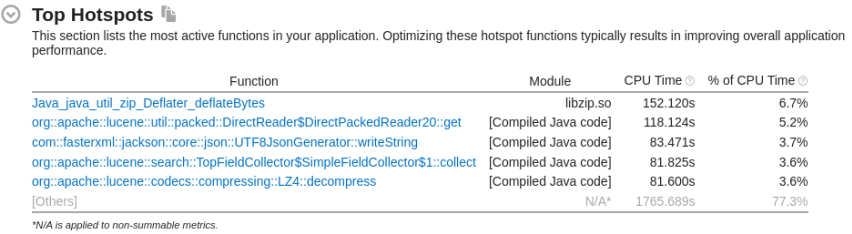
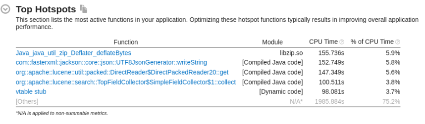

# 安装 rally

## 安装 python

由于 rally 要求 python 3.8 以上，所以需要重新下载一个 python 版本。

注：pyenv 是一个 python 版本管理工具，可以在同一个系统中切换不同的 python 版本。但由于安装过程中出现问题，且未能解决，所以选择自己手动下载 python 安装包，并且手动执行 python 和 pip 命令。


1. 更新 yum 源，安装所需的依赖：

```sh
yum update

yum install zlib-devel bzip2-devel openssl-devel ncurses-devel sqlite-devel readline-devel tk-devel libffi-devel gettext-devel libcurl-devel gcc make
```


2. 进入 python 下载官网，选择合适的压缩包：https://www.python.org/ftp/python/，或者直接用 wget

```sh
wget https://www.python.org/ftp/python/3.8.10/Python-3.8.10.tar.xz
```


3. 解压后，进入到解压后的 python 主目录下，进行编译，从而在 /usr/local 目录下生成 python3 目录。

```sh
cd /home/changyansong/Python/Python-3.8.10/

./configure --prefix=/usr/local/python3

make && make install
```

4. 添加环境变量

```sh
echo 'export PYTHON3_HOME=/usr/local/python3' >> /etc/profile
echo 'export PATH=$PYTHON3_HOME/bin:$PATH' >> /etc/profile

source /etc/profile
```

5. 测试是否安装成功：

```sh
python3 -V
pip3 -V
# 先更新 pip
pip3 install --upgrade pip
# 测试下载 numpy
pip3 install numpy
```


## 安装 git

1. 下载 git 安装包，注意去链接中查找最新的版本

```sh
wget https://mirrors.edge.kernel.org/pub/software/scm/git/git-2.9.5.tar.gz --no-check-certificate
```

2. 解压后进入 git 主目录，执行：

```sh
make prefix=/usr/local/git all
make prefix=/usr/local/git install
```

3.  卸载安装 Git 编译依赖时（在上一节 python 安装中）自动安装的低版本 Git：

```sh
# 找出旧版本git，显示为 rng-tools-6.13-1.git.d207e0b6.tl3.x86_64
rpm -qa | grep -w git
# 卸载
rpm -e rng-tools-6.13-1.git.d207e0b6.tl3.x86_64 --nodeps
```

4. 配置环境变量

```sh
echo 'export GIT2_HOME=/usr/local/git' >> /etc/profile
echo 'export PATH=$GIT2_HOME/bin:$PATH' >> /etc/profile

source /etc/profile
```

5. 测试是否安装成功

```sh
git --version
```


## 安装 esrally

如果下载速度过慢，可以在命令后面加上镜像下载的配置：`-i http://mirrors.aliyun.com/pypi/simple/ --trusted-host mirrors.aliyun.com`

```sh
pip3 install esrally 
```

安装好后可以测试一下是否安装成功：

```sh
esrally --version
```


踩坑：cannot import name 'soft_unicode' from 'markupsafe'

解决方法：卸载当前版本，安装旧版本

```sh
pip3 uninstall markupsafe

pip3 install markupsafe==2.0.1
```


## 数据准备

track 是赛道的意思，在这里是指压测用的数据和测试策略，track.json 便是压测策略的定义文件。

压测的工作，无非就是以下几个步骤：

- 指定/创建目标 ES 集群
- 创建索引、mapping
- 导入样本数据
- 进行读写操作
- 汇报压测结果

由于 Rally 运行时，需要从外网下载数据，所以改为手动下载。 


### 下载压测场景的配置（track）

```sh
# rally 下载后会在用户根目录生成 .rally 文件夹
mkdir -p ~/.rally/benchmarks

cd ~/.rally/benchmarks

git clone https://github.com/elastic/rally-tracks.git
```

查看 rally-tracks 项目提供的现成压测场景： 

```sh
esrally list tracks
```

跑 list 命令时，rally 自动做了一个 copy 动作 :

```sh
cd ~/.rally/benchmarks

mkdir tracks
# 将 rally-tracks 复制到一个新的目录 tracks/default 中
cp -r rally-tracks tracks/default
```

所以 rally-tracks 目录可以删掉了 ：

```sh
rm -rf rally-tracks
```


### 下载样本数据（data）

从 list 命令可以知道，不同的压测场景，样本数据的体积不一样。可以根据需求，下载需要的数据。这里以 geopoint 为例。 

```sh
cd /home/changyansong/.rally/benchmarks/tracks/default/
# download.sh 是 esrally 提供的自动下载数据集的脚本
./download.sh geopoint
# 下载后会在当前目录下生成 rally-track-data-geopoint.tar，解压到用户根目录
# 解压后，会自动在 ~/.rally/benchmarks/ 下新建 data/geopoint 目录，样本数据就保存在其中
tar -xvf rally-track-data-geopoint.tar -C ~/
```


如果用 download.sh 脚本下载过慢，可以选择手动下载， 首先写个脚本列出所有需要下载的样本数据地址：

```sh
# listfiles.sh
track_files=$(ls */track.json)
for track_file in $track_files; do 
    track_name=$(echo $track_file | awk -F '/' '{print $1}')
    echo $track_name

    baseurl=$(grep base-url $track_file | awk '{print $2}' | sed -e 's/,//g' -e 's/"//g' | head -n 1)
    #echo $baseurl

    for data_file in $(cat $track_name/files.txt); do
        url="$baseurl/$data_file"
        echo $url
    done | sort | uniq
    echo
    #break
done
```

执行后就会打印出所有样本数据的地址了，然后对所有地址进行 wget 就会快一些。


## 测试 esrally

启动 ES 后，在 geopoint 场景下测试 esrally：

```bash
esrally race --pipeline=benchmark-only --target-hosts=127.0.0.1:9200 --offline --track=geopoint
```







