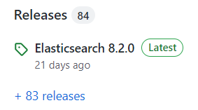
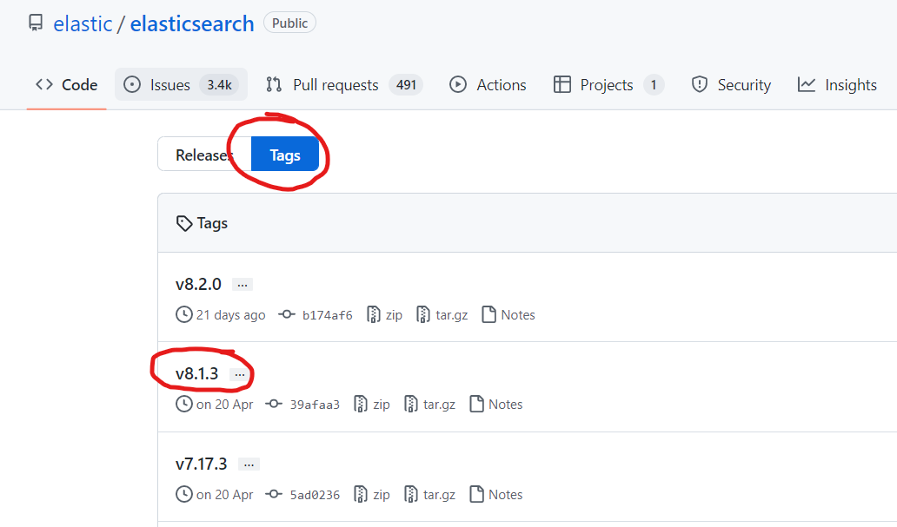

# git clone 加速

只需在 git clone 命令中将 gitclone.com 嵌入到克隆地址中即可。

例如将：

```sh
git clone https://github.com/elastic/elasticsearch.git
```

替换为：

```sh
git clone https://gitclone.com/github.com/elastic/elasticsearch.git
```


# git checkout 切换版本

通过 git clone 下载的项目文件，可以先 cd 到项目文件中，然后用 git checkout 命令切换版本。

1. 打开项目的历史发布版本：



2. 在 tag 中找到目标版本（如 v8.1.3）：



3. 在 clone 下来的本地项目目录中执行：

```sh
git checkout v8.1.3
```


