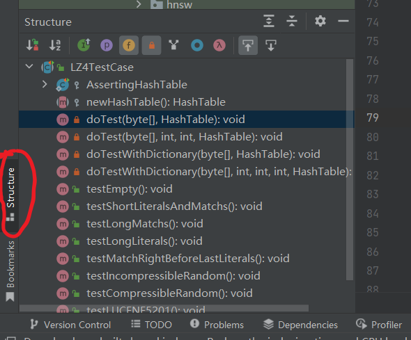
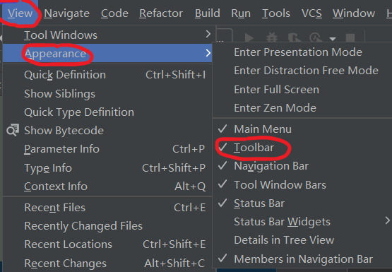

# 搜索

当前文件搜索：`ctrl + F`

全局文件搜索：按两下 `shift`

# 查看函数调用情况

作用：查看当前函数被哪些地方调用，或者调用了哪些函数

快捷键：`ctrl + alt + H`

# 查看当前 Java 文件的结构

作用：查看当前 Java 文件下有哪些变量和方法

快捷键：点 IDEA 界面左下角的 Structure 按钮

# 跳转返回

作用：由于经常需要 `ctrl + 左键` 查看代码，因此也需要跳转后能够返回上一层代码

快捷键：在菜单栏中勾选 Toolbar，之后就会在上方工具栏中出现左右箭头，点击返回即可。

